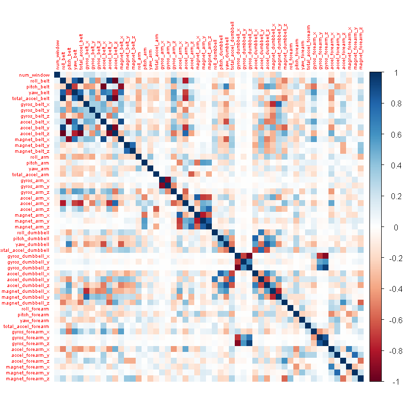
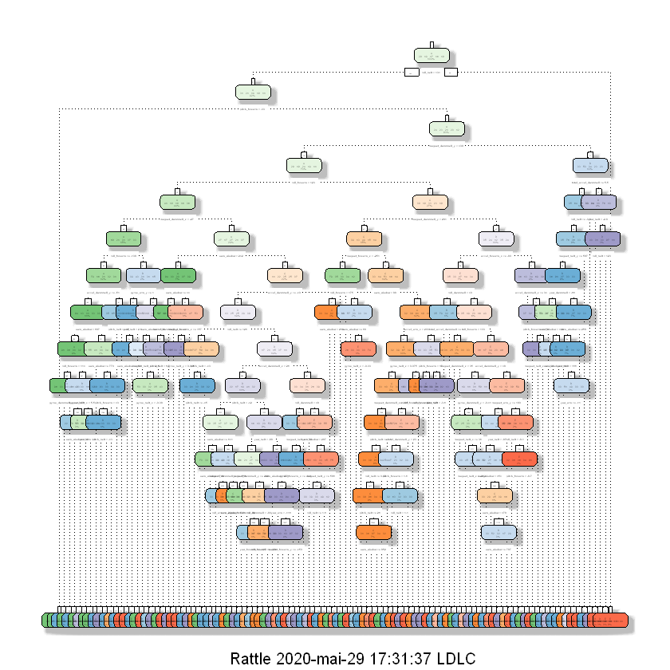

# Initialization and reproductibility


```R
library(rattle)
library(caret)
library(rpart)
library(rpart.plot)
library(corrplot)
library(randomForest)
library(RColorBrewer)
library(party)
```


```R
set.seed(135)
setwd("~/Practical-Machine-Learning-Johns-Hopkins-Bloomberg-School-of-Public-Health-Coursera")
```

# Getting Data


```R
trainFile = "./data/pml-training.csv"
testFile  = "./data/pml-testing.csv"

```


```R
trainRaw = read.csv(trainFile)
testRaw = read.csv(testFile)
dim(trainRaw)
dim(testRaw)
rm(trainFile)
rm(testFile)
```


<ol class=list-inline>
	<li>19622</li>
	<li>160</li>
</ol>


<ol class=list-inline>
	<li>20</li>
	<li>160</li>
</ol>


It should returns

19622 160
20 160

# Data Cleaning


```R
nZv = nearZeroVar(trainRaw, saveMetrics = TRUE)
head(nZv, 20)
```


<table>
<thead><tr><th></th><th scope=col>freqRatio</th><th scope=col>percentUnique</th><th scope=col>zeroVar</th><th scope=col>nzv</th></tr></thead>
<tbody>
	<tr><th scope=row>X</th><td>   1.000000 </td><td>100.00000000</td><td>FALSE       </td><td>FALSE       </td></tr>
	<tr><th scope=row>user_name</th><td>   1.100679 </td><td>  0.03057792</td><td>FALSE       </td><td>FALSE       </td></tr>
	<tr><th scope=row>raw_timestamp_part_1</th><td>   1.000000 </td><td>  4.26562022</td><td>FALSE       </td><td>FALSE       </td></tr>
	<tr><th scope=row>raw_timestamp_part_2</th><td>   1.000000 </td><td> 85.53154622</td><td>FALSE       </td><td>FALSE       </td></tr>
	<tr><th scope=row>cvtd_timestamp</th><td>   1.000668 </td><td>  0.10192641</td><td>FALSE       </td><td>FALSE       </td></tr>
	<tr><th scope=row>new_window</th><td>  47.330049 </td><td>  0.01019264</td><td>FALSE       </td><td> TRUE       </td></tr>
	<tr><th scope=row>num_window</th><td>   1.000000 </td><td>  4.37264295</td><td>FALSE       </td><td>FALSE       </td></tr>
	<tr><th scope=row>roll_belt</th><td>   1.101904 </td><td>  6.77810621</td><td>FALSE       </td><td>FALSE       </td></tr>
	<tr><th scope=row>pitch_belt</th><td>   1.036082 </td><td>  9.37722964</td><td>FALSE       </td><td>FALSE       </td></tr>
	<tr><th scope=row>yaw_belt</th><td>   1.058480 </td><td>  9.97349913</td><td>FALSE       </td><td>FALSE       </td></tr>
	<tr><th scope=row>total_accel_belt</th><td>   1.063160 </td><td>  0.14779329</td><td>FALSE       </td><td>FALSE       </td></tr>
	<tr><th scope=row>kurtosis_roll_belt</th><td>1921.600000 </td><td>  2.02323922</td><td>FALSE       </td><td> TRUE       </td></tr>
	<tr><th scope=row>kurtosis_picth_belt</th><td> 600.500000 </td><td>  1.61553358</td><td>FALSE       </td><td> TRUE       </td></tr>
	<tr><th scope=row>kurtosis_yaw_belt</th><td>  47.330049 </td><td>  0.01019264</td><td>FALSE       </td><td> TRUE       </td></tr>
	<tr><th scope=row>skewness_roll_belt</th><td>2135.111111 </td><td>  2.01304658</td><td>FALSE       </td><td> TRUE       </td></tr>
	<tr><th scope=row>skewness_roll_belt.1</th><td> 600.500000 </td><td>  1.72255631</td><td>FALSE       </td><td> TRUE       </td></tr>
	<tr><th scope=row>skewness_yaw_belt</th><td>  47.330049 </td><td>  0.01019264</td><td>FALSE       </td><td> TRUE       </td></tr>
	<tr><th scope=row>max_roll_belt</th><td>   1.000000 </td><td>  0.99378249</td><td>FALSE       </td><td>FALSE       </td></tr>
	<tr><th scope=row>max_picth_belt</th><td>   1.538462 </td><td>  0.11211905</td><td>FALSE       </td><td>FALSE       </td></tr>
	<tr><th scope=row>max_yaw_belt</th><td> 640.533333 </td><td>  0.34654979</td><td>FALSE       </td><td> TRUE       </td></tr>
</tbody>
</table>


We use the function nearZeroVar in order to use only predictors that is useful for us as a variable with variance near to zero cannot permit to discriminate the factors lead to the output. 


```R
training1 =  trainRaw[, !nZv$nzv]
testing1 = testRaw[, !nZv$nzv]
dim(training1)
dim(testing1)
```


<ol class=list-inline>
	<li>19622</li>
	<li>100</li>
</ol>


<ol class=list-inline>
	<li>20</li>
	<li>100</li>
</ol>


It should return

19622 100

20 100


```R
trainingB = training1[, !grepl("^X|timestamp|user_name", names(training1))]
testing = testing1[, !grepl("^X|timestamp|user_name", names(training1))]

```

We remove those three variable as it does not provide informations to accelerometer measurements


```R
dim(trainingB)
dim(testing)
```


<ol class=list-inline>
	<li>19622</li>
	<li>95</li>
</ol>


<ol class=list-inline>
	<li>20</li>
	<li>95</li>
</ol>


We should have 

19622 95

20 95


```R
condition=(colSums(is.na(trainingB)) == 0)
trainingB = trainingB[, condition]
testing = testing[, condition]
dim(trainingB)
dim(testing)
```


<ol class=list-inline>
	<li>19622</li>
	<li>54</li>
</ol>


<ol class=list-inline>
	<li>20</li>
	<li>54</li>
</ol>


We removed any columns that contain NA to avoid any problems withour algorithms.
Now we have a cleaned training data set with 19622 datas and 54 variables and testing data set with 20 observations and 54 variables.


```R
corrplot(cor(trainingB[, -length(names(trainingB))]), method = "color", tl.cex = 0.5)

```





# Step to Cross validations : Partitioning Training Set


```R
inTrain <- createDataPartition(trainingB$classe, p = 0.70, list = FALSE)

training <- trainingB[inTrain, ]
validation <- trainingB[-inTrain, ]
dim(training)
dim(validation)
dim(testing)
```


<ol class=list-inline>
	<li>13737</li>
	<li>54</li>
</ol>


<ol class=list-inline>
	<li>5885</li>
	<li>54</li>
</ol>


<ol class=list-inline>
	<li>20</li>
	<li>54</li>
</ol>


We use the carret function : createDataPartition in order to split our training data set to have 70% of training and 30% of validation (optimal farction according to course). We use this validation to have a cross validation.

Now we have a training data set with 13737 observations, a validation with 5885 and a testing with 20 observations.

# Predictive models

## Decision Tree


```R
modFit = train(classe ~ ., method = "rpart", data = training,
                       trControl=trainControl(method="none"),
                       tuneGrid=data.frame(cp=0.001))
```


```R
fancyRpartPlot(modFit$finalModel)
predictTree = predict(modFit, validation, type = "raw")
confusionMatrix(validation$classe, predictTree)

```

    Warning message:
    "labs do not fit even at cex 0.15, there may be some overplotting"


    Confusion Matrix and Statistics
    
              Reference
    Prediction    A    B    C    D    E
             A 1626   18    9    8   13
             B   49  985   61   23   21
             C    3   28  928   51   16
             D   13   15   54  856   26
             E    2   35   18   56  971
    
    Overall Statistics
                                              
                   Accuracy : 0.9118          
                     95% CI : (0.9043, 0.9189)
        No Information Rate : 0.2877          
        P-Value [Acc > NIR] : < 2.2e-16       
                                              
                      Kappa : 0.8884          
                                              
     Mcnemar's Test P-Value : 2.898e-08       
    
    Statistics by Class:
    
                         Class: A Class: B Class: C Class: D Class: E
    Sensitivity            0.9604   0.9112   0.8673   0.8612   0.9274
    Specificity            0.9885   0.9679   0.9796   0.9779   0.9771
    Pos Pred Value         0.9713   0.8648   0.9045   0.8880   0.8974
    Neg Pred Value         0.9841   0.9798   0.9708   0.9720   0.9842
    Prevalence             0.2877   0.1837   0.1818   0.1689   0.1779
    Detection Rate         0.2763   0.1674   0.1577   0.1455   0.1650
    Detection Prevalence   0.2845   0.1935   0.1743   0.1638   0.1839
    Balanced Accuracy      0.9745   0.9396   0.9235   0.9195   0.9522





Even with fancyrpartplot we can't see the tree but, we can see that there are a lot of seeds which can lead to an overfitting.

Yet, with the conffusion matrix on prediction on validation we have an accuracy of 91% which is raher good.


```R
print(postResample(predictTree, validation$classe))
```

     Accuracy     Kappa 
    0.9118097 0.8884431 
    

<font color='red'>We have an accuracy of 0.91 with the tree modelling </font>

## Random Forest

We use a predictive model for activity recognition using Random Forest as it selects important variables.
We will use 5-fold cross validation when applying the algorithm.


```R
modelFitRandom <- train(classe ~ ., data = training, method = "rf", trControl = trainControl(method = "cv", 5), ntree = 10)

```

We have a better accuracy than decision tree as expected


```R
modelFitRandom
```


    Random Forest 
    
    13737 samples
       53 predictor
        5 classes: 'A', 'B', 'C', 'D', 'E' 
    
    No pre-processing
    Resampling: Cross-Validated (5 fold) 
    Summary of sample sizes: 10990, 10989, 10990, 10989, 10990 
    Resampling results across tuning parameters:
    
      mtry  Accuracy   Kappa    
       2    0.9805634  0.9754097
      27    0.9928658  0.9909763
      53    0.9879888  0.9848072
    
    Accuracy was used to select the optimal model using the largest value.
    The final value used for the model was mtry = 27.


```R
predictRF = predict(modelFitRandom, validation)
confusionMatrix(validation$classe, predictRF)
```


    Confusion Matrix and Statistics
    
              Reference
    Prediction    A    B    C    D    E
             A 1672    2    0    0    0
             B    8 1126    5    0    0
             C    0    8 1016    2    0
             D    0    0    7  957    0
             E    0    2    0    5 1075
    
    Overall Statistics
                                             
                   Accuracy : 0.9934         
                     95% CI : (0.991, 0.9953)
        No Information Rate : 0.2855         
        P-Value [Acc > NIR] : < 2.2e-16      
                                             
                      Kappa : 0.9916         
                                             
     Mcnemar's Test P-Value : NA             
    
    Statistics by Class:
    
                         Class: A Class: B Class: C Class: D Class: E
    Sensitivity            0.9952   0.9895   0.9883   0.9927   1.0000
    Specificity            0.9995   0.9973   0.9979   0.9986   0.9985
    Pos Pred Value         0.9988   0.9886   0.9903   0.9927   0.9935
    Neg Pred Value         0.9981   0.9975   0.9975   0.9986   1.0000
    Prevalence             0.2855   0.1934   0.1747   0.1638   0.1827
    Detection Rate         0.2841   0.1913   0.1726   0.1626   0.1827
    Detection Prevalence   0.2845   0.1935   0.1743   0.1638   0.1839
    Balanced Accuracy      0.9974   0.9934   0.9931   0.9957   0.9993


```R
print(postResample(predictRF, validation$classe))
```

     Accuracy     Kappa 
    0.9933730 0.9916167 
    

<font color='red'>We have an accuracy of 0.99 which is better than decision tree as expected</font>

# Predicting for Test Data Set


```R
predict(modelFitRandom, testing[, -length(names(testing))])
```


<ol class=list-inline>
	<li>B</li>
	<li>A</li>
	<li>B</li>
	<li>A</li>
	<li>A</li>
	<li>E</li>
	<li>D</li>
	<li>B</li>
	<li>A</li>
	<li>A</li>
	<li>B</li>
	<li>C</li>
	<li>B</li>
	<li>A</li>
	<li>E</li>
	<li>E</li>
	<li>A</li>
	<li>B</li>
	<li>B</li>
	<li>B</li>
</ol>

<details>
	<summary style=display:list-item;cursor:pointer>
		<strong>Levels</strong>:
	</summary>
	<ol class=list-inline>
		<li>'A'</li>
		<li>'B'</li>
		<li>'C'</li>
		<li>'D'</li>
		<li>'E'</li>
	</ol>
</details>


```R

```
